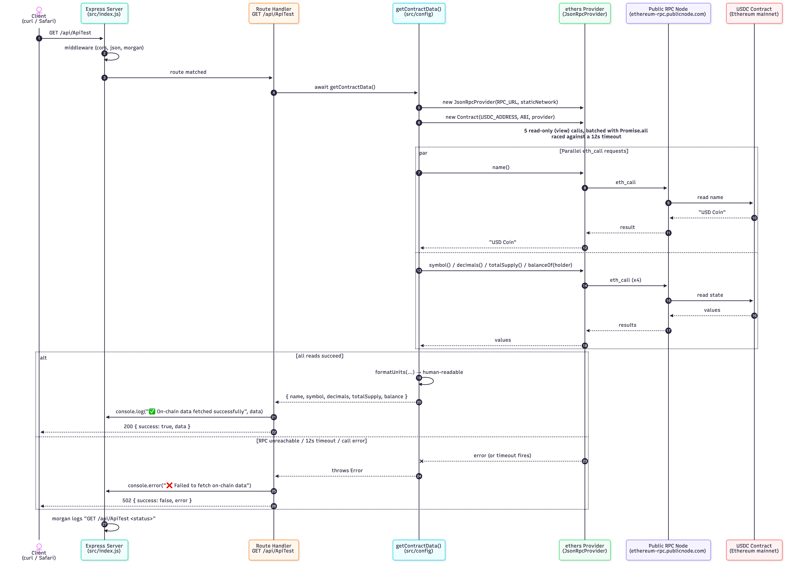
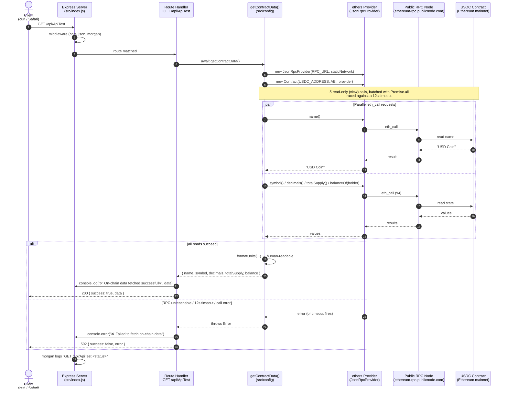

# `GET /api/ApiTest` — Sequence Diagram

How a request flows from the client through the Express server to the
Ethereum blockchain and back. The endpoint reads public state from the
**USDC** ERC-20 contract on mainnet via ethers.js and prints it to the console.

The diagram below is the Mermaid source that renders the image above.

## Notes

- **Read-only:** every blockchain call is an `eth_call` (a free, gasless read).
  No wallet, no transaction, no signing is involved.
- **Parallelism:** the five reads run concurrently via `Promise.all`, so total
  latency is roughly one round-trip, not five.
- **Resilience:** the call is raced against a 12-second timeout, and the provider
  uses `staticNetwork` to avoid ethers' indefinite network-detection retry loop —
  so the handler always responds (200 or 502) instead of hanging.
- **Console output:** the fetched data is logged on the server (the assessment's
  "result printed to the console" requirement) in addition to the HTTP response.
